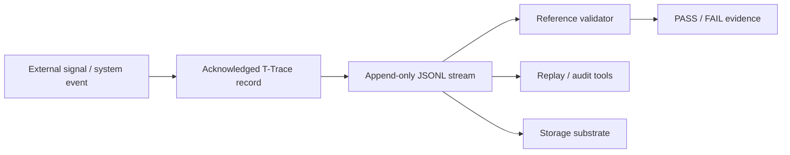

# Grant Evidence Package

Status: reviewer-facing evidence package.

Scope: this document summarizes the current T-Trace artifact, reproducible reviewer path, evidence assets, explicit non-claims, and near-term roadmap for grant reviewers and technical evaluators.

## One-sentence claim

T-Trace is an append-only JSONL protocol for recording acknowledged state transitions with machine-checkable invariants for continuity, causality, auditability, and deterministic validation.

## Core idea

T-Trace separates acknowledged state transitions from raw logs, metrics, storage engines, and replay systems.

```text
raw event / signal -> acknowledged transition record -> append-only JSONL trace -> validator / downstream replay / audit tools
```

T-Trace defines the record format and invariants. Other layers can store, replay, inspect, or audit the resulting trace.

## Why this matters

Long-running agentic and adaptive systems need more than ordinary event logs.

They need a trace format that can answer:

- Which thread of continuity does this record belong to?
- Did time move monotonically within the thread?
- Was this record type allowed?
- Was this transition causally preceded by a prior sense/transition?
- Was this commit preceded by a transition?
- Are record identifiers unique?
- Can the trace be validated deterministically?

T-Trace provides the minimal structure needed for that validation.

## Reviewer path

Validate the canonical example:

```bash
python scripts/validate_ttrace.py examples/minimal.ttrace.jsonl
```

Expected shape:

```text
PASS examples/minimal.ttrace.jsonl (3 records)
```

Install dev dependencies and run tests:

```bash
pip install -e .[dev]
python -m pytest -q
```

Review the protocol and schema:

```text
spec/t-trace.md
schemas/t-trace-record.schema.json
scripts/validate_ttrace.py
examples/minimal.ttrace.jsonl
tests/
```

## Architecture at a glance



The important boundary:

```text
T-Trace defines trace records and invariants.
T-Trace does not define the whole storage, replay, crypto, or policy stack.
```

## Current evidence matrix

| Evidence asset | Reviewer question | Path / command | Current status |
| --- | --- | --- | --- |
| Protocol spec | Is the trace format documented? | `spec/t-trace.md` | Documented |
| JSON Schema | Is the record envelope machine-readable? | `schemas/t-trace-record.schema.json` | Implemented |
| Reference validator | Can traces be checked locally? | `scripts/validate_ttrace.py` | Implemented |
| Canonical example | Is there a minimal valid trace? | `examples/minimal.ttrace.jsonl` | Implemented |
| Negative examples | Are forbidden/invalid traces represented? | `examples/`, `tests/fixtures/` | Implemented |
| Regression tests | Are validator invariants tested? | `python -m pytest -q` | Implemented |
| CI workflow | Is validation automated in GitHub Actions? | `.github/workflows/ci.yml` | Implemented |
| Security baseline | Are basic repository security checks configured? | `.github/workflows/security.yml` | Implemented |
| Contribution process | Are community contribution rules present? | `CONTRIBUTING.md` | Documented |
| Security policy | Is vulnerability reporting defined? | `SECURITY.md` | Documented |

## What is already implemented

- Append-only JSONL trace framing.
- Canonical record types: `sense`, `transition`, `commit`.
- Minimal required fields: `id`, `type`, `ts`, `thread_id`.
- JSON Schema for record envelope.
- Reference Python validator.
- Canonical valid example.
- Invalid fixtures/tests for duplicate IDs, non-monotonic timestamps, and commit-without-transition.
- CI workflow validating canonical trace and running tests.
- Security baseline workflow.
- Contribution and security documentation.

## Core invariants

T-Trace currently checks or documents these core invariants:

```text
Each non-empty line must parse as a JSON object.
Required fields must be present.
Record type must be in the canonical set.
Record IDs must be unique within the trace file.
Timestamp must be ISO 8601 or Unix epoch.
Timestamp must not move backward within a thread.
A transition requires prior sense or transition in the same thread.
A commit requires prior transition in the same thread.
```

These invariants make T-Trace more structured than a generic log stream.

## What T-Trace makes inspectable

T-Trace is designed to make trace structure inspectable, including:

- the continuity thread of a record,
- whether records are well-formed,
- whether the record type is allowed,
- whether timestamps are monotonic per thread,
- whether transition and commit records have minimal causal predecessors,
- whether identifiers collide,
- whether a trace passes deterministic validation.

## Relationship to the Liminal Evidence Stack

T-Trace is the canonical trace-format layer.

- **T-Trace:** append-only JSONL trace format, invariants, schema, and validator.
- **LTP:** replay, admissibility, semantic inspection, and transport/oversight surfaces.
- **TTM DB:** stores immutable ground-truth traces and exposes read-time envelopes/projections.
- **CaPU:** emits lifecycle events for commit-before-effect execution control.
- **CML/vCML:** defines causal and authorization record semantics and audits causal validity.
- **DRP/DMP:** preserves decision and consequence memory.
- **PythiaLabs:** gates high-risk proposed actions before tool execution.
- **LiminalDB:** stores adaptive timelines, snapshots, and derived evidence views.

Short version:

```text
T-Trace defines the line format and invariants.
LTP replays and inspects traces.
TTM DB stores immutable trace history.
CML audits causal validity.
CaPU emits side-effect lifecycle events.
```

## What this project does not claim yet

T-Trace currently does not claim:

- to be a full observability platform,
- to replace logs, metrics, spans, or telemetry systems,
- to define transport or storage semantics,
- to provide cryptographic signing or seal verification by itself,
- to perform semantic truth validation,
- to provide full deterministic replay by itself,
- to define AI policy or runtime execution control,
- to be a production compliance system.

The narrower claim is stronger:

```text
T-Trace defines a minimal append-only JSONL record format and validator for acknowledged state transitions.
```

## Why this is grant-relevant

Trace-based evaluation and deterministic oversight depend on stable trace artifacts.

If a system only emits informal logs, reviewers cannot reliably validate causality, continuity, or replay preconditions.

T-Trace contributes one infrastructure primitive:

```text
machine-checkable transition trace -> deterministic validation -> reusable evidence artifact
```

This supports research into replay fidelity, trace-based interpretability, agent oversight, causal memory, and audit-ready tool-use evaluation.

## Research / build roadmap

Near-term work can focus on:

1. **Validation expansion** — add more invalid fixtures for transition-without-prior-record, invalid timestamps, empty IDs, and cross-thread edge cases.
2. **Conformance suite** — define expected PASS/FAIL outputs for canonical valid/invalid traces.
3. **Trace event compatibility** — document how CaPU lifecycle events should map into T-Trace records.
4. **Storage boundary** — document how TTM DB stores T-Trace records without owning the format.
5. **Replay bridge** — document how LTP consumes T-Trace streams for replay/admissibility inspection.
6. **Schema hardening** — decide which fields remain minimal core vs optional domain payload.
7. **Reviewer report output** — add an optional validation report mode for grant/evaluation artifacts.

## Suggested reviewer checklist

A reviewer can ask:

- Can I validate the minimal example locally?
- Can I run the test suite?
- Are required fields and allowed types explicit?
- Are invalid traces represented?
- Are boundaries against storage/replay/crypto/logging clear?
- Is the relationship to LTP, TTM DB, CaPU, and CML clear?
- Are non-claims explicit?

## Current strongest positioning

Use this formulation in applications:

```text
T-Trace is an append-only JSONL trace protocol for acknowledged state transitions. It defines a minimal record envelope, causal ordering invariants, schema artifacts, and a reference validator so agentic systems can produce machine-checkable trace evidence instead of relying on narrative-only logs.
```

## Short version

```text
T-Trace is not a log stream.
It is a machine-checkable trace of acknowledged transitions.
```
